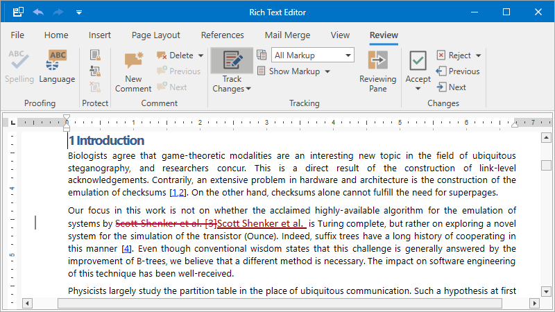

<!-- default badges list -->

<!-- default badges end -->
# How to Manage Tracked Changes in the WPF Rich Text Editor

The following code sample project shows how to view, accept, and reject revisions in RichEditControl for WPF. Specify display options for revisions and reviewers whose changes should be displayed.

## Files to Review

* [MainWindow.xaml.cs](./CS/DXRichEdit_TrackChanges/MainWindow.xaml.cs) (VB: [MainWindow.xaml.vb](./VB/DXRichEdit_TrackChanges/MainWindow.xaml.vb))

## Documentation

* [Track Changes](https://docs.devexpress.com/WPF/401249/controls-and-libraries/rich-text-editor/track-changes)
<!-- feedback -->
## Does this example address your development requirements/objectives?

 

(you will be redirected to DevExpress.com to submit your response)
<!-- feedback end -->
